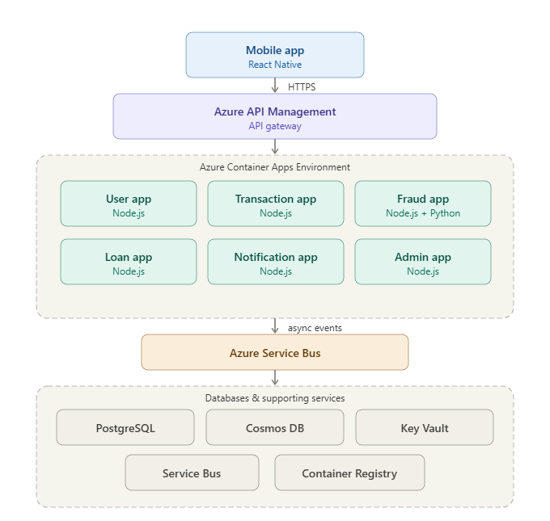

# FinLink Cloud-Native

FinLink is an AI-powered inclusive digital payments and micro-lending platform designed as a cloud-native university project. It targets unbanked and underbanked users with a mobile-first wallet experience, real-time fraud detection, and event-driven microservices on Azure.

## Why This Project

- Solves a real problem: financial inclusion plus digital payment fraud prevention.
- Matches cloud-native rubric areas directly: scalability, high availability, security, sync/async communication, IaC, CI/CD.
- Strong portfolio value: fintech + cloud + AI + DevOps in one project.

## Project Scope (MVP)

- User registration and wallet creation
- Deposit and withdraw simulation (bank transfer / cash-in / cash-out)
- Instant P2P transfers and QR-based simulation
- Micro-loan application flow with simple credit scoring
- Real-time fraud checks for transactions
- Notifications and transaction history
- Admin dashboard for monitoring and compliance views

## Users

- Unbanked users: people with no bank account; they can keep funds in-wallet and transact digitally.
- Underbanked users: people with a bank account but limited access/usability; they can move funds between bank and wallet.
- Admin/compliance users: monitor suspicious activity, health metrics, and alerts.

## High-Level Architecture (Azure)

- Client: React Native + Expo mobile app
- API Layer: Azure API Management
- Compute: Azure Container Apps (ACA) Environment for Node.js container apps
- Async Messaging: Azure Service Bus (queues/topics)
- Data: PostgreSQL + Cosmos DB
- Security: Microsoft Entra ID (B2C), Key Vault, RBAC, encryption
- Observability: Azure Monitor + Application Insights + Log Analytics
- DevOps: Terraform + GitHub Actions + ACR image delivery

## Architecture Diagram



Architecture reference:
- Full details: `docs/SYSTEM_ARCHITECTURE.md`
- Diagram image: `docs/azure_mobile_app_architecture_v2.png`

## Microservices

The backend is built using **Python (FastAPI)** and consists of the following microservices:

- `user-service`: Authentication, user profiles, and onboarding.
- `wallet-service`: Ledger entries, transactions recording, and balance tracking.
- `transaction-service`: Transfer handling and orchestrations.
- `fraud-service`: Real-time fraud analysis using heuristics and/or ML models.
- `loan-service`: Micro-loan application flow and simple credit scoring.
- `notification-service`: Status updates and async alerts via Service Bus events.

## Repository Structure

```text
finlink-cloud-native/
├── datasets/                  # ML/Fraud datasets and schema docs
├── docs/                      # Architecture diagrams and reports
├── infrastructure/            # Terraform IaC for Azure (ACA, APIM, Postgres, etc.)
├── mobile-frontend/           # React Native + Expo App
├── services/                  # Python FastAPI microservices
│   ├── fraud-service/         
│   ├── loan-service/          
│   ├── notification-service/  
│   ├── transaction-service/   
│   ├── user-service/          
│   └── wallet-service/        
├── docker-compose.yml         # Local development environment
└── README.md
```

## How to Run It (Local Development)

To run the project locally, you will need **Docker**, **Docker Compose**, and **Node.js** (for Expo).

### 1. Start the Backend Infrastructure
The local environment spins up PostgreSQL, RabbitMQ/Redis (if configured), and all microservices in containers.
```bash
docker-compose up --build -d
```
You can verify the services are running by accessing their Swagger UI docs (e.g., `http://localhost:8001/docs` depending on mapping).

### 2. Start the Mobile Frontend
Go to the `mobile-frontend` directory, install dependencies, and run Expo:
```bash
cd mobile-frontend
npm install
npx expo start
```
You can run it on your physical device using the Expo Go app by scanning the QR code, or locally in an iOS Simulator / Android Emulator.

## Cloud Deployment (Azure)

The project leverages **Terraform** to provision Azure Container Apps (ACA), Azure Service Bus, Azure API Management (APIM), and Azure PostgreSQL.

### Prerequisites
- [Azure CLI](https://docs.microsoft.com/en-us/cli/azure/install-azure-cli) (run `az login`)
- [Terraform](https://developer.hashicorp.com/terraform/downloads)

### Deployment Steps
1. **Initialize Terraform:**
   ```bash
   cd infrastructure
   terraform init
   ```
2. **Review the Deployment Plan:**
   ```bash
   terraform plan
   ```
3. **Apply the Plan:**
   ```bash
   terraform apply -auto-approve
   ```
4. **Deploy Application Code:**
   Code is automatically tested, built into Docker images, and deployed to Azure via **GitHub Actions** workflows when pushing to the `main` branch.

## Datasets and Resources

- Fraud datasets: Kaggle credit card fraud datasets (for training/testing fraud checks)
- Lending datasets: Kaggle P2P lending datasets (for loan simulation)
- Architecture and implementation notes: `docs/SYSTEM_ARCHITECTURE.md`

