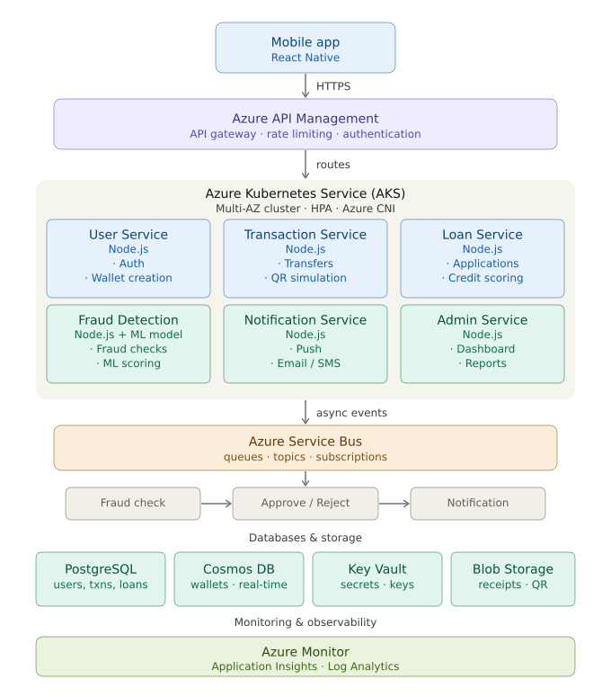

# 1. High-Level Architecture Overview

FinLink follows a cloud-native microservices + event-driven architecture on Azure.

**Key principles demonstrated:**
- **Scalability:** AKS Horizontal Pod Autoscaler + auto-scaling
- **High Availability:** Multi-AZ AKS + read replicas + failover
- **Sync + Async communication:** Azure API Management (sync) + Azure Service Bus (async)
- **Security:** Zero-trust with Entra ID, Key Vault, encryption
- **Extensibility:** Loose-coupled events (add new services without downtime)
- **Polyglot persistence:** PostgreSQL + Cosmos DB
- **DevOps:** Terraform + GitHub Actions

## Architecture Diagram

---

# 2. Detailed Component Breakdown (Azure Services)

| **Component**       | **Azure Service**                                 | **Tech Stack**                    | **Responsibility & Why It Fits Assignment**                                      |
|---------------------|---------------------------------------------------|-----------------------------------|----------------------------------------------------------------------------------|
| Mobile Frontend     | N/A (client)                                      | React Native + Expo               | User-facing wallet, transfers, loans. Mobile-first = realistic. Calls APIs only.  |
| API Gateway         | Azure API Management                              | REST + GraphQL                    | Single entry point, rate limiting, JWT validation, versioning. Sync comms.        |
| Microservices       | Azure Kubernetes Service (AKS)                    | Node.js + Express/Docker          | 6 independent services. Scalable with HPA.                                        |
| Auth                | Microsoft Entra ID (B2C)                          | JWT + MFA                         | Zero-trust auth for all users/admins.                                             |
| Async Messaging     | Azure Service Bus                                 | Queues & Topics                   | Fraud detection, notifications, loan processing. Demonstrates async clearly.      |
| Databases           | PostgreSQL Flexible Server + Cosmos DB            | SQL + NoSQL                       | Polyglot: relational for money + NoSQL for scale.                                 |
| AI Fraud            | Azure Container in AKS + scikit-learn/Azure ML    | Python/Node model                 | Real-time scoring on every transaction.                                           |
| Storage             | Azure Blob Storage                                | —                                 | QR codes, receipts.                                                               |
| Secrets             | Azure Key Vault                                   | Managed Identity                  | Encryption at rest/transit.                                                       |
| Monitoring          | Azure Monitor + App Insights                      | Grafana optional                  | Dashboard in video demo.                                                          |

---

# 3. Communication Methods

- **Synchronous:** Mobile → API Management → AKS service (REST/GraphQL). Example: User clicks “Transfer”.
- **Asynchronous:** Transaction Service publishes event to Service Bus → Fraud Service consumes → decides approve/reject → Notification Service consumes. No blocking, resilient.

---

# 4. Sample Data Flows

**Example 1: P2P Transfer (sync + async)**
- User A → Mobile → API Mgmt → Transaction Service (sync).
- Transaction Service writes to PostgreSQL + publishes event to Service Bus.
- Fraud Service (async) runs ML check → if OK, update wallet in Cosmos DB.
- Notification Service sends push/email (simulated).

**Example 2: Micro-Loan Application**
- User applies (sync).
- Loan Service calls simple AI model.
- Async approval flow via Service Bus.

**Example 3: Scaling Demo**
- Simulate 1,000 concurrent transfers → AKS HPA scales pods automatically.

---

# 5. Security Architecture

- Entra ID B2C for auth + MFA.
- All traffic over HTTPS + WAF in API Management.
- Data encrypted at rest (PostgreSQL TDE + Cosmos DB).
- Managed Identity + RBAC (least privilege).
- Audit logs to Log Analytics.
- Rate limiting & IP restrictions.

---

# 6. Scalability & High Availability

- AKS cluster in 2+ Availability Zones.
- Horizontal Pod Autoscaler (CPU/memory).
- Cosmos DB auto-scale throughput.
- PostgreSQL read replicas + geo-replication.
- Circuit breakers (Resilience4j or Polly in Node).

---

# 7. Deployment & DevOps

- Infrastructure as Code: Terraform (AzureRM provider).
- CI/CD: GitHub Actions → build Docker images → push to ACR → deploy to AKS.
- One-command deploy: terraform apply && az aks deploy (or Helm).
- Blue-green or canary for zero-downtime feature addition.
